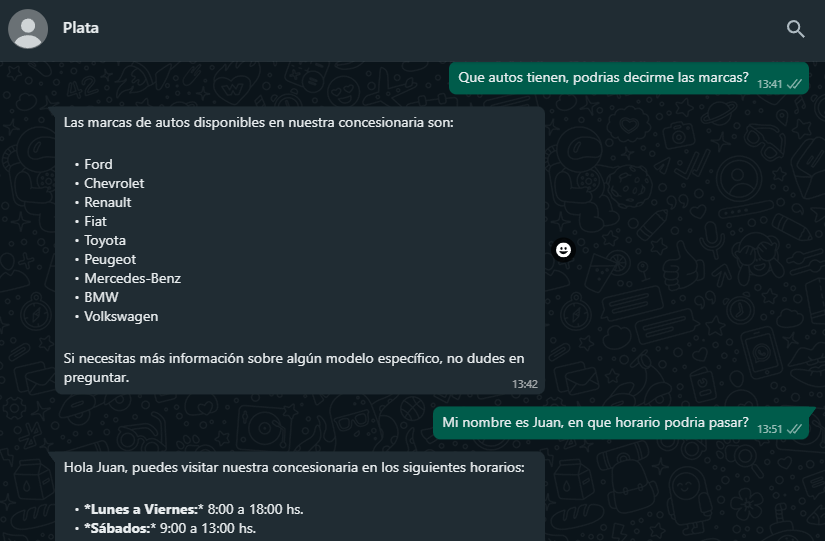

# LangGraph WhatsApp Chatbot w/ tools and persistent memory

**Plata** is a whatsapp chatbot designed to interact with customers and answer their questions! It's built with **Flask**, **Langgraph**, **Langchain** and uses the **Meta WhatsApp API**.



## Features

*   **NLP:** Understands and answers the questions.
*   **More than one tool:** Uses an Langgraph agent to select the appropiate tool for each question:
    *   **RAG:** Answers questions using the txt files in `/data`, whose embeddings are stored in a `FAISS` vector db.
    *   **SQL db query:** Accesses to a PostgreSQL db to answer questions about structured data. Uses Langchain `SQLDatabaseToolkit`.
*   **Persistent memory:** Remembers the chat history of each user using Langgraph `PostgresSaver`, storing the chat state in a PostgreSQL db.
*   **WhatsApp integration:** Connected to the WhatsApp API to receive and send messages.

## How to run

1. **Install requirements:**
    ```bash
    pip install -r requirements.txt
    ```

2. **.env example in root:**
    ```dotenv
    OPENAI_API_KEY=""
    DATABASE_URL=""
    
    APP_ID=""
    APP_SECRET=""
    ACCESS_TOKEN=""
    VERSION=""
    RECIPIENT_WAID=""
    PHONE_NUMBER_ID=""
    VERIFY_TOKEN=""
    ```
3. **Init ngrok:**
    Use the same port as the flask app.
    ```bash
    ngrok http 8000 --domain domain.ngrok-free.app
    ```